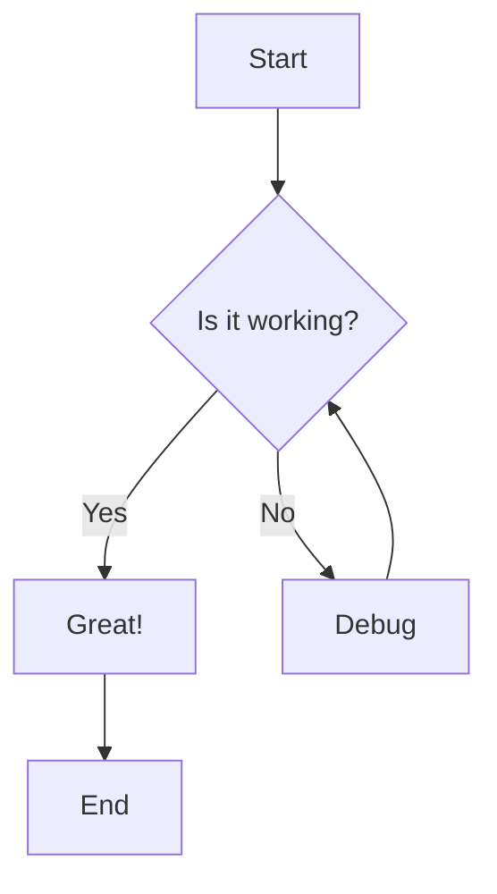
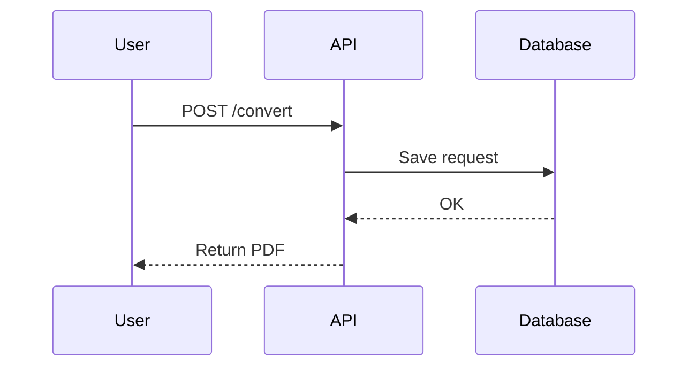
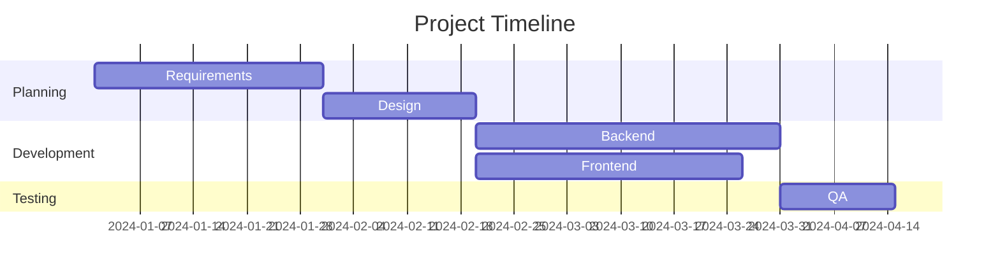

# Advanced Markdown to PDF Demo

## 1. LaTeX Math Support

### Inline Math

Persamaan kuadrat memiliki bentuk umum $ax^2 + bx + c = 0$ dengan solusi menggunakan rumus ABC.

### Display Math (Centered)

$$
x = \frac{-b \pm \sqrt{b^2 - 4ac}}{2a}
$$

### Complex Equations

Integral dari fungsi eksponensial:

$$
\int_0^\infty e^{-x^2} dx = \frac{\sqrt{\pi}}{2}
$$

### Matrix

$$
\begin{bmatrix}
a & b \\
c & d
\end{bmatrix}
\begin{bmatrix}
x \\
y
\end{bmatrix}
=
\begin{bmatrix}
ax + by \\
cx + dy
\end{bmatrix}
$$

### Align Environment

$$
\begin{align}
f(x) &= x^2 + 2x + 1 \\
     &= (x + 1)^2
\end{align}
$$

---

## 2. Mermaid Diagrams

### Flowchart



### Sequence Diagram



### Gantt Chart



---

## 3. Advanced Markdown Features

### Tables with Alignment

| Syntax    | Description | Value |
| :-------- | :---------: | ----: |
| Header    |    Title    |  $100 |
| Paragraph |    Text     |   $50 |
| **Bold**  |  Emphasis   |   $75 |

### Task Lists

- [x] Support LaTeX math rendering
- [x] Add Mermaid diagram support
- [x] Implement Pandoc parser
- [ ] Add code syntax highlighting themes
- [ ] Support for custom CSS themes

### Code Blocks with Syntax Highlighting

```python
def fibonacci(n):
    """Calculate Fibonacci number recursively"""
    if n <= 1:
        return n
    return fibonacci(n-1) + fibonacci(n-2)

# Generate first 10 Fibonacci numbers
fib_sequence = [fibonacci(i) for i in range(10)]
print(fib_sequence)
```

```javascript
// Async/await example
async function fetchData(url) {
  try {
    const response = await fetch(url);
    const data = await response.json();
    return data;
  } catch (error) {
    console.error("Error:", error);
  }
}
```

### Blockquotes with Math

> **Theorem (Pythagorean)**
>
> Dalam segitiga siku-siku, berlaku:
>
> $$a^2 + b^2 = c^2$$
>
> dimana $c$ adalah sisi miring (hipotenusa).

### Footnotes

Here's a sentence with a footnote[^1].

[^1]: This is the footnote content with math: $E = mc^2$

### Subscript and Superscript

- Chemical formula: H~2~O
- Power notation: x^2^ + y^2^ = r^2^

### Strikethrough

~~This text is crossed out~~

---

## 4. Scientific Formulas

### Physics

**Einstein's Mass-Energy Equivalence:**
$$E = mc^2$$

**Newton's Second Law:**
$$F = ma = m\frac{d^2x}{dt^2}$$

**Schrödinger Equation:**
$$i\hbar\frac{\partial}{\partial t}\Psi(\mathbf{r},t) = \hat{H}\Psi(\mathbf{r},t)$$

### Statistics

**Normal Distribution:**
$$f(x|\mu,\sigma^2) = \frac{1}{\sqrt{2\pi\sigma^2}}e^{-\frac{(x-\mu)^2}{2\sigma^2}}$$

**Bayes' Theorem:**
$$P(A|B) = \frac{P(B|A)P(A)}{P(B)}$$

### Calculus

**Taylor Series:**
$$f(x) = \sum_{n=0}^{\infty}\frac{f^{(n)}(a)}{n!}(x-a)^n$$

---

## 5. Summary

✅ **Supported Features:**

- LaTeX inline and display math ($...$, $$...$$)
- Mermaid diagrams (flowchart, sequence, gantt, etc.)
- GitHub Flavored Markdown (GFM)
- Tables with alignment
- Task lists
- Code blocks with syntax highlighting
- Footnotes
- Subscript/Superscript
- Strikethrough
- And much more!

---

**Generated by**: Markdown PDF Service v2.0  
**Powered by**: Pandoc + Playwright + MathJax + Mermaid

Oke, dari data yang kamu berikan:

| Jumlah | Harga Retail | Diskon  | Total     | Diskon (%) |
| ------ | ------------ | ------- | --------- | ---------- |
| 8      | 179.000      | 300.720 | 1.131.280 | ?          |
| 1      | 426.000      | 59.640  | 366.360   | ?          |

Kita tahu rumus umum untuk menghitung **persentase diskon** adalah:

[
\text{Diskon (%)} = \frac{\text{Diskon}}{(\text{Harga Retail} \times \text{Jumlah})} \times 100
]

---

### Hitung manual:

#### Baris 1:

[
\text{Harga Retail Total} = 179.000 \times 8 = 1.432.000
]
[
\text{Diskon (%)} = \frac{300.720}{1.432.000} \times 100 = 21%
]

#### Baris 2:

[
\text{Harga Retail Total} = 426.000 \times 1 = 426.000
]
[
\text{Diskon (%)} = \frac{59.640}{426.000} \times 100 = 14%
]

---

### Jadi hasil akhirnya:

| Jumlah | Harga Retail | Diskon  | Total     | Diskon (%) |
| ------ | ------------ | ------- | --------- | ---------- |
| 8      | 179.000      | 300.720 | 1.131.280 | **21%**    |
| 1      | 426.000      | 59.640  | 366.360   | **14%**    |

---

Kalau kamu mau pakai rumus Excel, misalnya:

- Kolom **Jumlah** = `N2`
- Kolom **Harga Retail** = `O2`
- Kolom **Diskon** = `P2`

Maka rumusnya:

```excel
= P2 / (N2 * O2)
```

Lalu ubah format kolom menjadi **Percentage (%)** supaya hasilnya otomatis tampil seperti 21% atau 14%.
